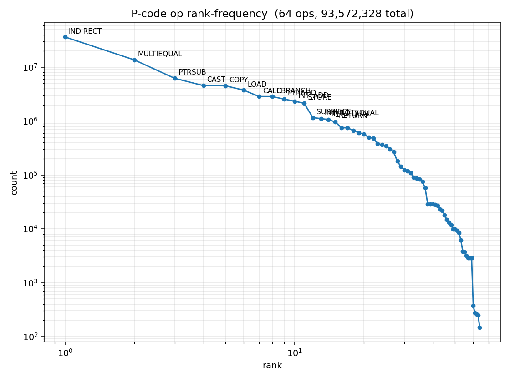
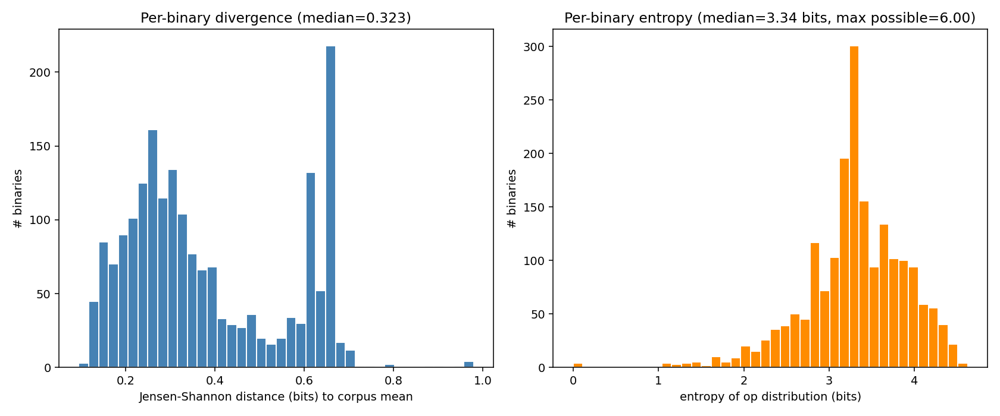
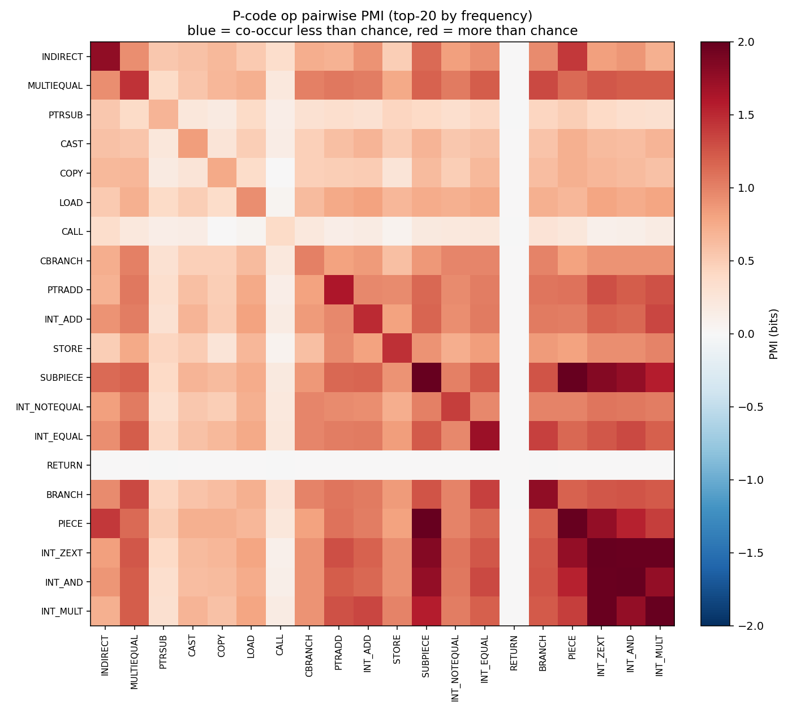
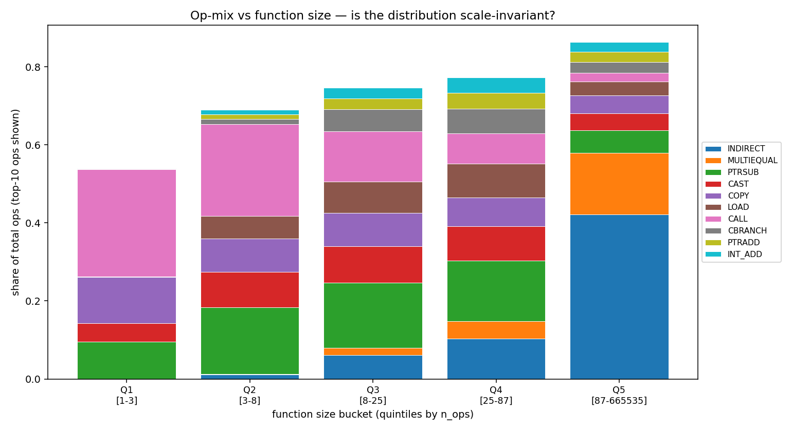

# P-code op distribution study — Assemblage Linux ELF corpus

- Binaries with at least one decompiled function: **1,931**
- Total decompiled functions: **626,461**
- Binaries hitting the per-binary time budget (truncated): **24**

### Analysis 1: Overall op frequency + Zipf

- Unique P-code op types observed: **64**
- Total ops counted (sum across all binaries): **93,572,328**
- Top-10 ops cover **85.2%** of all ops
- Top-5 ops cover **69.9%** of all ops

**Top 15 by frequency**

| rank | op | count | freq |
|---:|---|---:|---:|
| 1 | `INDIRECT` | 36,417,817 | 0.3892 |
| 2 | `MULTIEQUAL` | 13,693,533 | 0.1463 |
| 3 | `PTRSUB` | 6,224,118 | 0.0665 |
| 4 | `CAST` | 4,559,474 | 0.0487 |
| 5 | `COPY` | 4,522,995 | 0.0483 |
| 6 | `LOAD` | 3,742,952 | 0.0400 |
| 7 | `CALL` | 2,856,129 | 0.0305 |
| 8 | `CBRANCH` | 2,848,000 | 0.0304 |
| 9 | `PTRADD` | 2,558,012 | 0.0273 |
| 10 | `INT_ADD` | 2,336,255 | 0.0250 |
| 11 | `STORE` | 2,138,869 | 0.0229 |
| 12 | `SUBPIECE` | 1,162,040 | 0.0124 |
| 13 | `INT_NOTEQUAL` | 1,111,728 | 0.0119 |
| 14 | `INT_EQUAL` | 1,068,783 | 0.0114 |
| 15 | `RETURN` | 965,392 | 0.0103 |

**Zipf head (top-20) log-log slope:** `-1.336` (Zipf's law predicts ≈ -1)

**Power-law fit (Clauset et al. method)**
- α (exponent on tail): `2.269`
- x_min (cutoff below which power-law not claimed): `2138869.0`
- vs exponential: R=`1.80`, p=`0.0716` (power-law preferred)
- vs lognormal:   R=`0.10`, p=`0.921` (inconclusive/other)
- vs truncated power-law: R=`-0.21`, p=`0.86`

### Analysis 2: Per-binary stability

- Each binary's op-distribution compared to the corpus mean via Jensen-Shannon distance (0 = identical, 1 = orthogonal).
- Median JS distance: **0.323**, 95th pct: 0.656, max: 0.979
- Median op-distribution entropy: **3.34 bits** (max possible with 64 ops = 6.00 bits)

**5 most typical binaries (lowest JS to corpus mean)**

| binary | n_fns | n_ops | JS |
|---|---:|---:|---:|
| `kizuna_engine` | 261 | 72,670 | 0.095 |
| `librnsHEAAN.so` | 298 | 66,837 | 0.102 |
| `bpmm` | 441 | 282,271 | 0.116 |
| `pr` | 76 | 25,404 | 0.119 |
| `connectivity_tool` | 1244 | 159,963 | 0.119 |

**5 most atypical binaries (highest JS to corpus mean)**

| binary | n_fns | n_ops | JS |
|---|---:|---:|---:|
| `libfoo.so.debug` | 8 | 8 | 0.979 |
| `libfoo.so.debug` | 8 | 8 | 0.979 |
| `a.out.debug` | 8 | 8 | 0.979 |
| `libfoo.so.debug` | 8 | 8 | 0.979 |
| `TestModule.so` | 1 | 2 | 0.947 |

### Analysis 3: Op co-occurrence (PMI)

Over **626,461** functions, presence of each top-20 op was tabulated and pairwise pointwise mutual information computed:

**Top 5 most positively associated pairs (op_a AND op_b co-occur more than chance)**

| op_a | op_b | PMI (bits) | P(joint) |
|---|---|---:|---:|
| `SUBPIECE` | `PIECE` | +2.07 | 0.063 |
| `INT_ZEXT` | `INT_AND` | +1.98 | 0.071 |
| `INT_ZEXT` | `INT_MULT` | +1.97 | 0.069 |
| `SUBPIECE` | `INT_ZEXT` | +1.84 | 0.080 |
| `SUBPIECE` | `INT_AND` | +1.76 | 0.075 |

**Top 5 most negatively associated pairs**

| op_a | op_b | PMI (bits) | P(joint) |
|---|---|---:|---:|
| `RETURN` | `BRANCH` | -0.01 | 0.288 |
| `PTRSUB` | `RETURN` | -0.00 | 0.620 |
| `CALL` | `RETURN` | -0.00 | 0.763 |
| `COPY` | `CALL` | +0.00 | 0.454 |
| `MULTIEQUAL` | `RETURN` | +0.00 | 0.368 |

### Analysis 4: Function-size scaling

Functions binned by n_ops quintile. Op-mix in each quintile reported as share-of-total.

| bucket | range | n_fns | total ops |
|---|---|---:|---:|
| Q1 [1-3] | [1–3] | 145,227 | 335,169 |
| Q2 [3-8] | [3–8] | 177,743 | 815,867 |
| Q3 [8-25] | [8–25] | 134,468 | 1,948,347 |
| Q4 [25-87] | [25–87] | 130,825 | 6,389,764 |
| Q5 [87-665535] | [87–665535] | 125,359 | 84,646,679 |

**JS distance Q1 vs Q5 (over top-10 ops):** `0.798` (closer to 0 = scale-invariant; closer to 1 = different)

